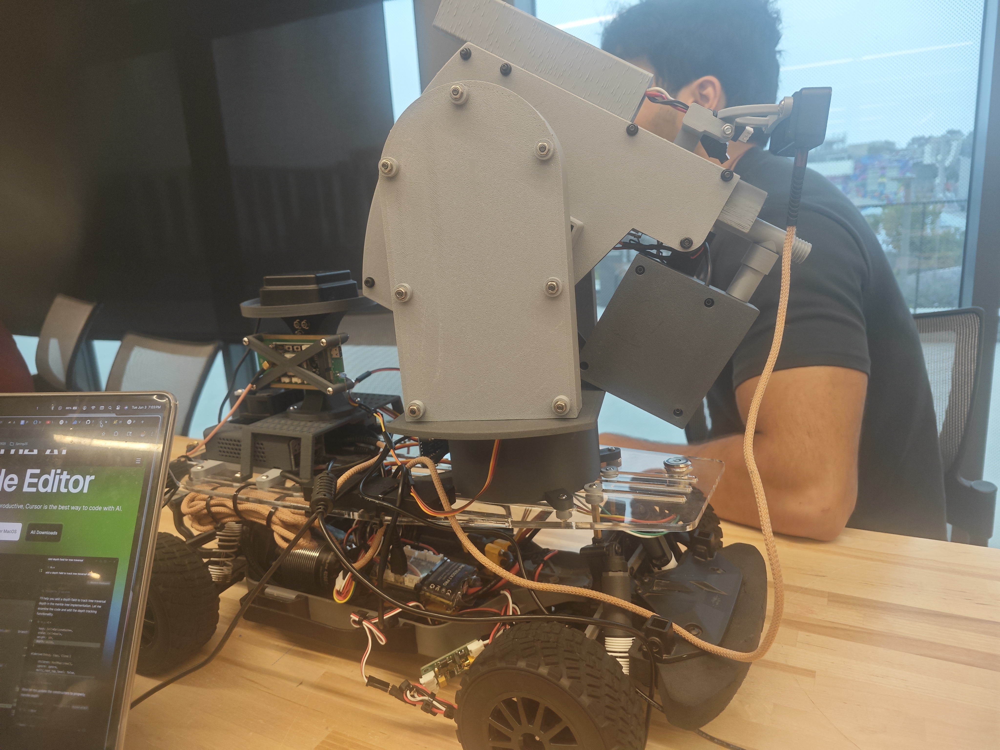
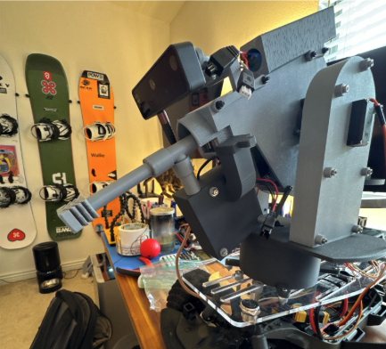
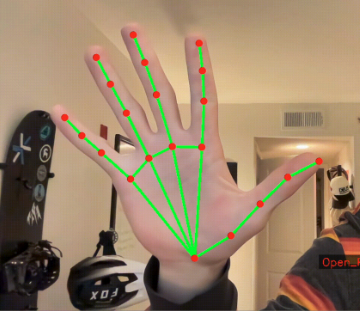
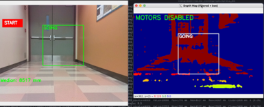
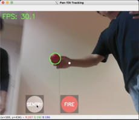
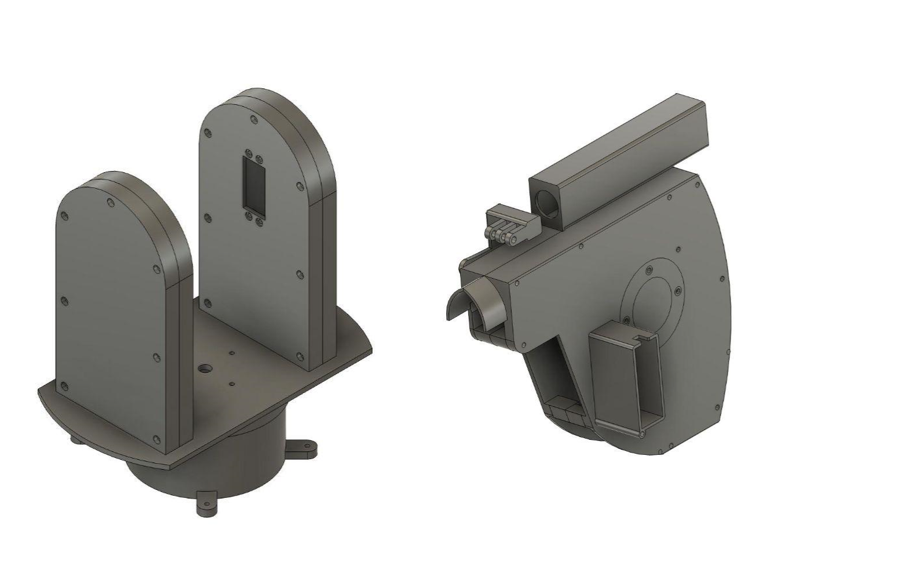
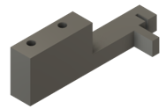
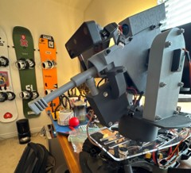

# Projectile Launching Autonomous Vehicle

### ECE148 Final Project  

**Team 14 Spring 2025**

---

---

## Table of Contents

1. [Team Members](#team-members)  
2. [Final Project](#final-project)  
   - [Original Goal](#original-goal)  
   - [Future Goal](#future-goal)  
3. [Features](#features)  
4. [Hardware List](#hardware-list)  
5. [Highlight Implementation](#highlight-implementation)  
   - [Redball Recognition](#redball-recognition)  
   - [Gesture Detection](#gesture-detection)  
   - [ROS2 Integration](#ros2-integration)  
6. [Future Improvements](#future-improvements)  
7. [Final Project Documentation](#final-project-documentation)  
   - [We Didn't Work On](#we-didnt-work)  
   - [Modes](#modes)  
     - [Driving Mode](#driving-mode)  
     - [Sentry Mode](#sentry-mode)  
     - [Firing at Target](#firing-at-target)  
8. [Acknowledgments](#acknowledgments)  
9. [Contact](#contact)

---

## Team Members

**Brandon Hargitay, Brett Kinsella, Sohan Lele, Yiting Chen**

- Brandon Hargitay - Computer Science  
- Brett Kinsella - Electrical & Computer Engineering  
- Sohan Lele - Mechanical & Aerospace Engineering  
- Yiting Chen - Electrical & Computer Engineering  

---

## Final Project

## Original Goal

Our project set out to demonstrate a compact, fully autonomous vehicle that combines perception, decision-making, and precision engagement in a single platform. The key objectives were:

1. **Camera Gesture Control**  
   - Leverage onboard vision to recognize a predefined set of hand or body gestures.  
   - Translate each gesture into a high-level mission command (e.g. “Begin mission,” “Standby,” “Return to base”).  

2. **Waypoint Navigation & Target Search**  
   - Drive autonomously to a user-specified GPS coordinate (simulated for this proof-of-concept).  
   - Perform a systematic 360° scan upon arrival, using computer vision techniques to detect and isolate individual objects in the environment.  

3. **Foe Classification & Remote Validation**  
   - Run a lightweight classifier (e.g. color/shape, AprilTag) to assign each detected object as**Foe**.  
   - For any object labeled “Foe,” stream a live video snapshot back to a remote operator interface, pausing further action until the human sends a “Launch Authorized” signal.  

4. **Projectile Launch & Autonomous Return**  
   - Upon operator approval, fire a soft rubber projectile at the confirmed hostile target with millimeter-level aiming corrections.  
   - Immediately after launch, plan and execute a safe return route back to the original start point.  

5. **Continuous Obstacle Avoidance**  
   - Throughout both outbound and inbound legs, use LiDAR and ultrasonic sensors to detect obstacles within 0.5 m.  
   - Execute reactive avoidance maneuvers (stop, rotate, replan) to maintain a collision-free trajectory.  

---

## Future Goal

**Full GPS-Based Mission Planning**  

- Integrate a commercial GPS module and update the navigation stack to accept real-time latitude/longitude waypoints.  
- Develop an adaptive path planner that dynamically reroutes around newly detected obstacles or no-go zones.  
- Incorporate energy-aware behaviors (battery monitoring, auto-return on low power) to enable extended, untethered field operations.

## Features

- **Real-Time Gesture Recognition:** OAK-D camera detects and translates gestures on-the-fly.  
- **Projectile Launching Mechanism:** Custom-designed rubber projectile launcher integrated with the perception system for precise aiming and firing, complete with hardware and software safety interlocks to prevent accidental launches.  
- **Red Ball Recognition Mechanism:** Vision pipeline tuned to detect and track red spherical objects—using color segmentation in HSV space and contour analysis—to identify targets, estimate their position in 3D space, and feed aiming data to the launcher.  
- **Efficient Processing:** All perception tasks (gesture, object and red-ball recognition) run onboard the OAK-D vision module, offloading compute from the Jetson Nano.  
- **ROS 2 Integration:** Seamless inter-module communication via ROS 2 topics and services, with clear message interfaces for commands, sensor data, and status updates.  

### Hardware List

- OAK-D Camera  
- Jetson Nano  
- Projectile Launcher  

---

## Highlight Implementation

Created a Hallway clearing robot
Car can autonomously drive down a hallway, stopping when it approaches the end
Turret is able to scan the vicinity looking for potential targets
Turret is able to fire at any potential threat if confirmed by the human operator

### Redball Recognition

- OAK-D camera detects and recognizes red balls in the environment.  
- Red ball recognition is used for navigation, task execution, target searching, and projectile launching. 
- Once a red ball target is confirmed, the launcher is triggered to fire a rubber projectile at it.  
- Safety features are implemented to avoid accidental firing and ensure operation only under authorized conditions.   

### Gesture Detection

- Uses OAK-D camera to capture hand gestures in real-time.  
- Recognizes predefined gestures that map to specific vehicle commands (e.g., start, stop, turn).  
- Gesture detection is processed onboard, enabling intuitive, touch-free control of the vehicle.  

### ROS2 Integration

- ROS2 links the perception and launching modules.  
- Enables seamless data exchange and coordinated operation for target acquisition and projectile launching.  

---

## Future Improvements

1. **GPS navigation:**  
   In the future, we plan to integrate GPS navigation into the autonomous vehicle system. This feature will enable the robot to autonomously drive to user-specified GPS coordinates, allowing for more complex and flexible mission planning. The robot will be able to determine its current location, calculate optimal routes, and navigate through various environments. Implementing GPS navigation will also facilitate outdoor tasks and long-distance missions, making the system more versatile and practical for r...

2. **More object and gesture recognition:**  
   In the future, we aim to expand the system's perception capabilities to recognize a wider variety of objects and hand gestures. This will enable the robot to interact with more complex environments and respond to a broader range of user commands. Enhanced object recognition can support tasks such as identifying specific items, obstacles, or people, while advanced gesture recognition will allow for more intuitive and flexible human-robot interaction. These improvements will make the system smarter, saf...

---

## Final Project Documentation

### We didn't work

-Creating the turret housing was more complicated than we anticipated
Originally were going to use just a simple projectile launcher
Wanted to avoid calculating the projectile motion when firing, but accidently created additional complexity
-**GPS Ros Node**  
There was no documentation for the ROS node for GPS waypoint navigation
-**Lidar**  
After we realized GPS wouldn’t be feasible we were hoping to get lidar working, but getting acquainted with a brand new component and getting it working within a week time frame did not seem feasible

### Modes

#### Driving mode

Car is able to detect using camera vision how far away the end of the hallway is
Car drives straight until it gets close to the wall and automatically comes to a stop
Uses OAK-D camera with stereo depth 
Measures object shift between views to detect obstacles ahead
Processes depth data and publishes motor commands to control the car

#### Sentry mode

Sentry mode is enabled at the click of a button by the human user
Turret pans the camera 180 degrees looking for a potential target
-The turret’s movement is controlled by two servos, the first controls the yaw and another controls the pitch 
-C-RAM: Utilizes color masking to follow the color red
When it catches the red color the turret locks onto the target and traces it movement

#### Firing at Target

Once the turret has locked onto a potential target, the human operator has the option to fire at that target
-Fires using another servo with a actuation connector which pulls the trigger
-The turret fires for 1 second, firing an average of 4 gels per actuation

## Acknowledgments

We would like to recognize the help from Professor Jack Silberman, TA Alexander, Winston, Jingli for an amazing Spring 2025 class! Thank you Alexander for the amazing instruction and help.

---

## Contact

- **Brandon:** [bhargitay@ucsd.edu](mailto:bhargitay@ucsd.edu)  
- **Brett:** [bkinsell@ucsd.edu](mailto:bkinsell@ucsd.edu)  
- **Sohan:** [slele@ucsd.edu](mailto:slele@ucsd.edu)  
- **Yiting:** [chenytseu@163.com](mailto:chenytseu@163.com)  
